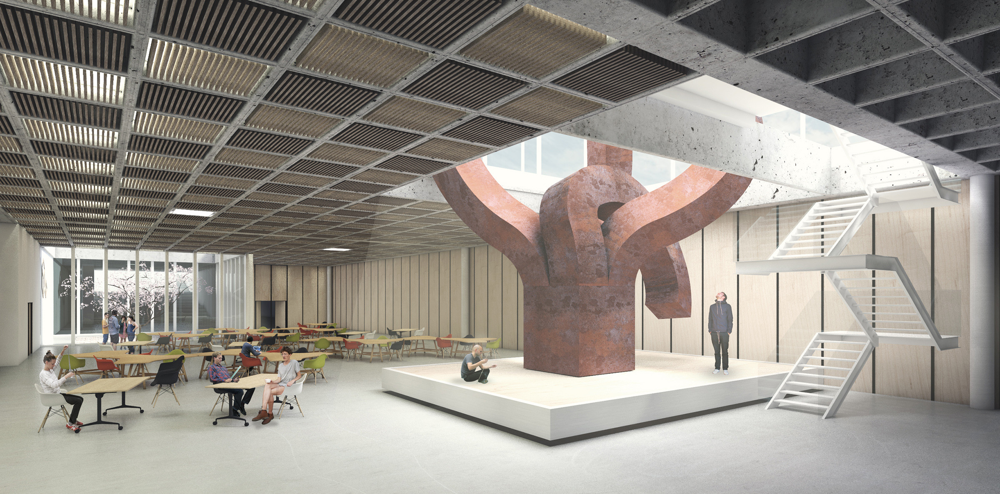

# Creative Station  / Estación creativa

The synergy of shared workspaces

Nowadays, the rise of land and leasing prices are making the individual workspace an unachievable goal. However, sharing a workspace and its infrastructure does not only bring economical benefits but also performance improvements. These days, more people are likely to work within communities of like-minded individuals, who tend to be potential partners and/or clients.

New ways of working

The way people work and relate to their own or other people's jobs is constantly changing.
The mass media and the competitive markets created a need in showcasing our own projects. Now, not just the product, but the production of it must be shown to the audience.

The project

It's a building where the line between working, learning and socializing does not longer exist. This is possible by the spatial and organizational flexibility allowed by the mobile panels and elevators. While most of the program is located in the underground level (workspaces, conference rooms, exhibition spaces and restaurants), there’s a plaza of “boxes” in the ground level. Those boxes are  a manifestation of the underground building, which allow the user to see what’s going on inside, and also, through elevating platforms, to move bigger objects and people rapidly.

La sinergia de los espacios de trabajo compartidos 

Actualmente, el alza en el valor del suelo y los costos de alquileres e insumos hacen que el espacio de trabajo individual sea cada vez más difícil de alcanzar. Sin embargo, compartir un espacio de trabajo con toda su infraestructura no solo trae beneficios económicos, sino también productivos. Cada vez más, la gente prefiere trabajar dentro de comunidades de personas con intereses similares, ya que les permite conocer posibles socios y/o clientes. 

Nuevas dinámicas de trabajo 

La manera en que la gente trabaja y se relaciona al trabajo propio y ajeno cambia constantemente. Con la incursión de los mass media, la competencia y la necesi- dad de dar a conocer el trabajo propio se volvieron fundamentales. Ya no solo el producto, sino también la producción, debe estar entonces al alcance del público.
 
El proyecto

Se trata de un edificio en donde la línea entre trabajar, aprender y socializar se desdibuja a favor de nuevas posibilidades. Esto es posible mediante la flexibilidad espacial/organizacional que permiten los paneles móviles y los elevadores. Mientras que en la cota -6,2m se encuentra la mayor parte del programa (espacios de trabajo, auditorios, exposición y gastronomía), en la cota +-0,0m se encuentra la plaza de las cajas. Dichas cajas son manifestaciones terrestres del proyecto subterráneo, que permiten ver que sucede por debajo y a su vez, mediante los elevadores, movilizar tanto objetos de vastas dimensiones como grandes masas de personas rápidamente. 

