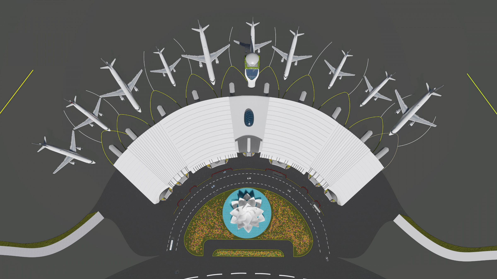
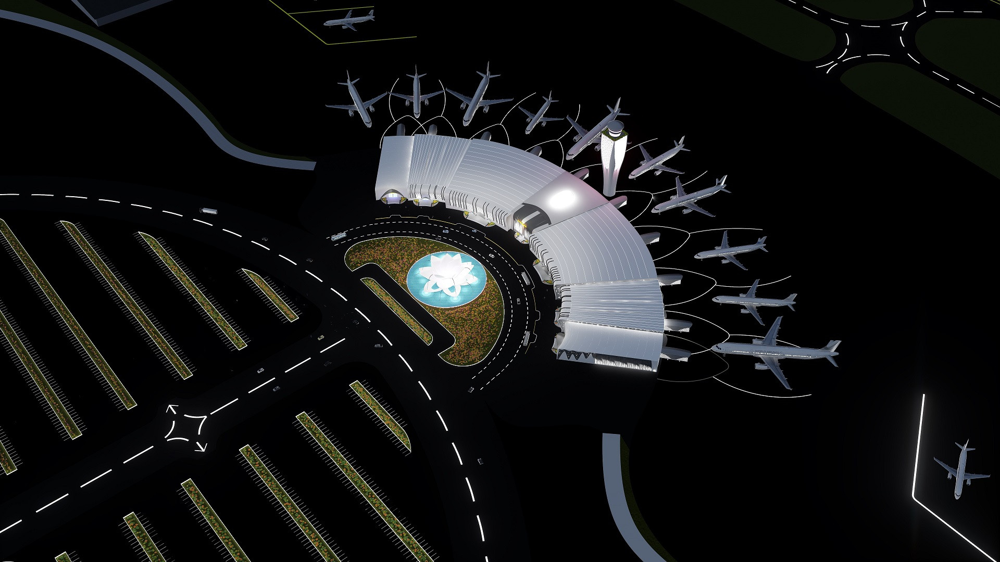
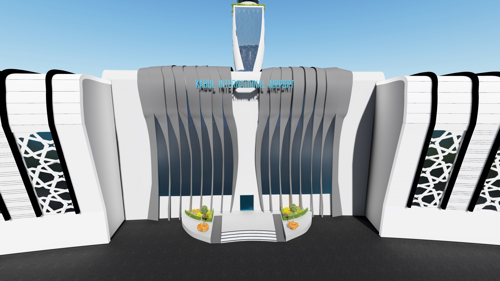
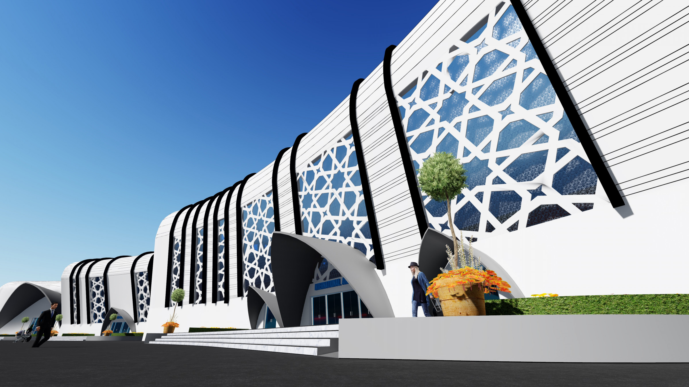
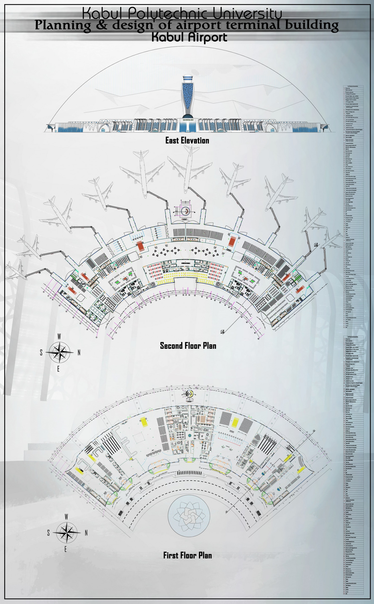
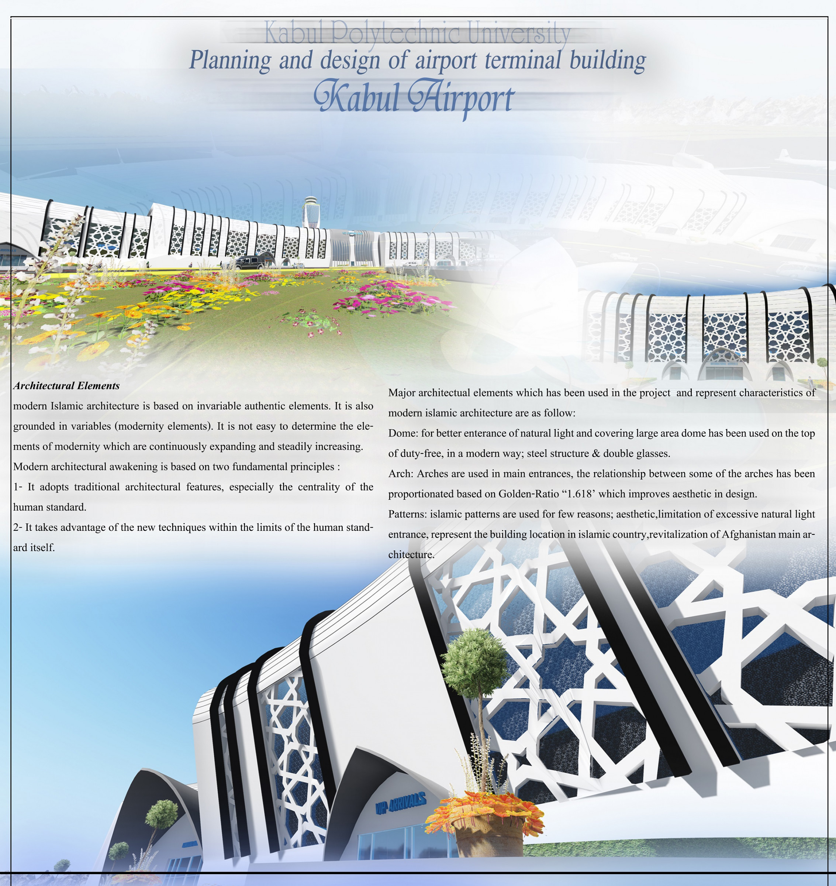
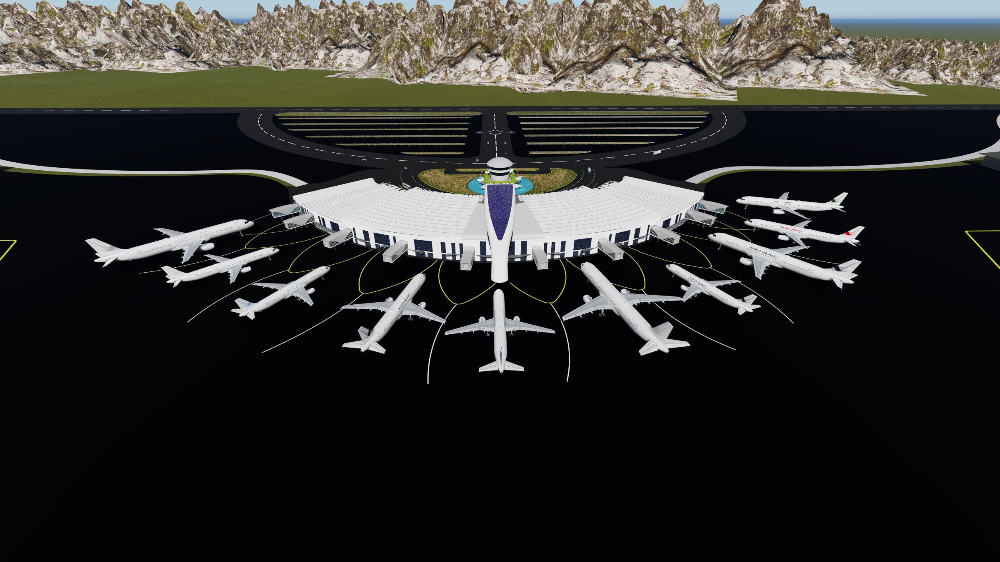
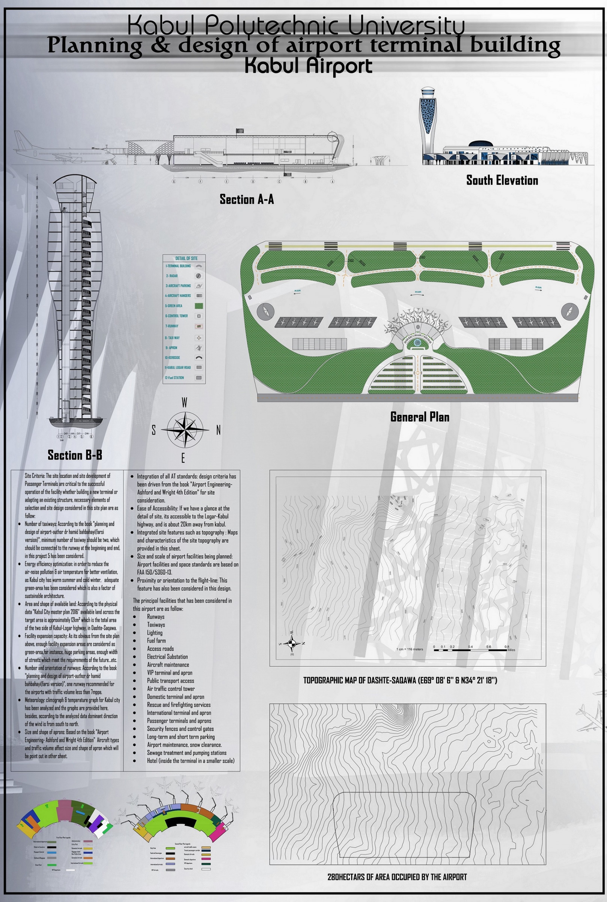

# Planning and design of Airport Terminal Building(Kabul Airport)

Airports play a vital role in economic development, and the most important cargo they move is people.
The central core of this movement is terminal building; where people are moved from landside to airside and so on.
HKIA (Hamid Karzai International Airport) terminal building which is located in Kabul city has been surveyed, and this project has been designed with consideration of the problems we had in HKIA.
Common problems were as follow:
1-	Difficulties in finding certain paths by passengers
2-	Unconnected circulation areas with the upcoming operation field
3-	Lack of signages
4-	Unstandardized spaces
5-	Lack of restaurant
6-	Lack of duty free
7-	Lack of transit passenger’s corridor
8-	Insufficient height of control tower
9-	Not enough space for administration offices
10-	Problems in security control
Furthermore, this project (Kabul International Airport) has been designed based on analyzed problems, design has been done to meet international as well as HKIA requirements, for instance, HKIA has 4.5mppa and the designed project has space for more than 6mppa.
In addition, Location of HKIA is near to the city where its surrounded by residential buildings and passengers encounter transportation problems from across the city to the HKIA, however, this issue has been considered in this project, thus, new location has been suggested for Kabul International Airport.
Furthermore, Standards and terminal facilities are withdrew as recommended by FAA AC 150/5360-13, and all standards are based on the code FAA (Federal Aviation Administration).
Overall terminal space has been calculated based on the book (Ashford and wright, airport engineering page 430), as it recommends that; 10,000 m^2 of floor space per 1mppa.
To sum it up, in this project (Kabul International Airport) maximum facilities and minimum waiting time has been considered for the passengers.
 

